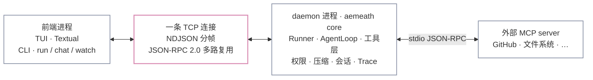
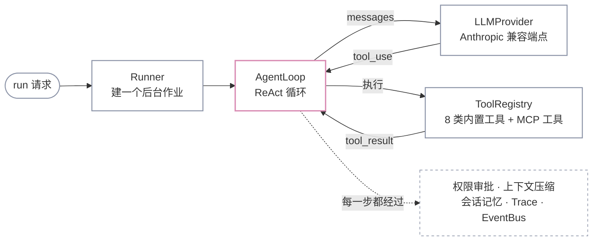

<div align="center">


# AemeathCode

**一个从零手搓的 Coding Agent —— 既是能跑的终端 AI Agent,也是一趟看得见的系统工程学习历程。**

[](https://www.python.org/)
[](https://github.com/Nijikasuki/AemeathCode/blob/main/LICENSE)
[](https://docs.python.org/3/library/asyncio.html)
[](https://textual.textualize.io/)
[](https://modelcontextprotocol.io/)
[](https://github.com/Nijikasuki/AemeathCode/actions/workflows/ci.yml)

**简体中文** · [English](https://github.com/Nijikasuki/AemeathCode/blob/main/README_EN.md)

</div>


<sub>一个 run 正在跑:左边是它的思考,中间是工具调用和流式回答,右边是它给自己列的任务和这一轮改过的文件。</sub>

---

## 它是什么

给它一个目标,它自己规划步骤、读写文件、执行命令、观察结果,循环推进直到做完 —— 全程在终端里看得见。

它由两个进程组成:前台界面和后台常驻的 daemon,中间是一条自己实现的多路复用协议。ReAct 循环、工具注册表、会话记忆、权限审批、上下文压缩、子 agent、MCP 客户端,全部用纯 Python + asyncio 从零写,**没有用任何 agent 框架**。

这是一个学习与展示型项目。它能真实执行 shell 命令、真实写文件 —— 请在你信任的目录里跑(见[安全声明](#安全声明))。

---

## 装上,跑起来

**支持 Linux / macOS / Windows + WSL2。Windows 原生跑不起来**,而且不打算适配。

<details>
<summary>为什么 Windows 原生不支持</summary>

不是没适配好,是几处核心机制本身就依赖 POSIX:

| 位置 | Windows 上的问题 |
|---|---|
| daemon 收 SIGINT / SIGTERM | 用的 `loop.add_signal_handler`,Windows 事件循环没有这个 API |
| `aemeath stop` | 靠进程组信号收尾,Windows 没有进程组信号这套东西 |
| `bash` 工具 | 整个工具是按 POSIX shell 写的,落到 `cmd.exe` 上语义全变 |

硬撑着跑起来只会得到一个处处是坑的版本,所以选择明确不支持。Windows 上装个 WSL2 再照下面走:

```powershell
wsl --install          # 管理员 PowerShell,装完重启,之后所有命令都在 WSL 终端里敲
```
</details>

### 1. 装 uv

唯一的前置依赖。uv 是一个静态二进制,不需要你先有 Python —— 它会自己把 Python 3.12 下下来。

```bash
curl -LsSf https://astral.sh/uv/install.sh | sh
```

> 装完 **当前终端还用不了 `uv`**:安装脚本改的是 shell 配置文件,得重开终端,或者 `source ~/.bashrc`。

### 2. 装 AemeathCode

```bash
uv tool install aemeathcode
```

> 如果 uv 提示 `~/.local/bin` 不在 `PATH` 上,跑一次 `uv tool update-shell`,**然后同样要重开终端**。
>
> 注意**命令名是 `aemeath`,包名是 `aemeathcode`**。升级和卸载都用包名:
> `uv tool upgrade aemeathcode` / `uv tool uninstall aemeathcode`。
>
> 已经有 pipx 的话直接 `pipx install aemeathcode` 也一样,不用为了这个再装 uv。

### 3. 跑

```bash
aemeath
```

就这一条。第一次跑会弹配置向导问你三件事(API Key、Base URL、模型名),填完就进界面。

底层是「后台 daemon + 前端」双进程,但你不用管它 —— `aemeath` 会自己探活,没有就在后台拉起 daemon 再进界面(像 `docker` 那样)。daemon 常驻,下次秒进;用完 `aemeath stop` 关掉。

对接任何 **Anthropic Messages API 兼容**的端点:官方、DeepSeek、自建网关都行。

---

## 它怎么工作

### ReAct 循环

一个 run 就是一段循环:把对话发给模型 → 模型要么直接回答、要么说「我要调这几个工具」→ 执行工具 → 把结果塞回对话 → 再发给模型 → 直到它不再要工具。

看起来简单,真正难的是**配对**:模型发出的每一个 `tool_use` 块,下一轮必须有一个 `tool_result` 块对应上,少一个、顺序错一个,整轮对话在 API 那边就废了。工具执行失败、被权限拒绝、参数缺失 —— 这些情况下**照样要回一个 result**,只是内容是错误说明。这条铁律是 `agent/loop.py` 里最不能出错的地方。

内置八类工具:读文件、写文件、跑 shell、列目录、任务增删查改、长期笔记、加载 skill、派子 agent。

### 动手前它会问你


写文件和执行命令会在**真正执行之前**被拦下来,daemon **反向**问前端要授权 —— 同一条 TCP 连接,平时是客户端发请求、daemon 回响应,审批时方向反过来。

两个刻意的设计:

- **审批面板显示它要写的完整内容**,不是只给你一个文件名让你盲签。审批请求自带完整参数,不依赖事件流。
- **被拒绝的调用会留痕**。Content 里画一行 `× write_file / 权限被拒绝`,而 Changes 面板不给它记账 —— 因为它压根没执行。「这个工具开始执行了」和「模型想调它」是两件事,事件流里分得很清楚。

批准时可以选「这次」或「永远」,选了永远会记住,下次同类操作不再问。

### 它记得住东西

记忆分三层作用域,各管各的:

| 范围 | 存什么 | 活多久 |
|---|---|---|
| 一个 run 内 | 这一轮的思考、工具调用和结果 | run 结束 |
| 一个 session 内 | 多轮对话的完整历史 | 落盘,可以 `/resume` 回来接着聊 |
| 跨 session | agent 自己用 `note_save` 写下的长期笔记、你手写的项目记忆 `AEMEATH.md` | 一直在 |

消息按 run 增量存,加一层索引把它们拼成完整历史 —— 所以恢复会话时能精确重建,而不是把一个大文件读进来。

### 上下文满了会自己压

历史越滚越长,逼近 token 预算时自动触发压缩:老轮次交给**一次独立的辅助 LLM 调用**概括成摘要,最近几轮**逐字保留**(尾巴逐字比全部概括更 faithful —— 模型刚说过的话不该被转述)。

压缩只动内存里的工作副本,**磁盘上的原始记录一个字不改**。所以 resume 回来拿到的仍然是完整历史。

### 能力边界可以往外扩

- **子 agent** —— 主 agent 把子任务丢进一个隔离的上下文里跑,只有结果回来,中间过程不污染主对话。子 agent 还能扮演不同角色(profiles)。
- **Skills** —— 按需加载的操作手册。平时只有**简介**常驻 system prompt(让模型知道「有这么个技能」),模型真调 `use_skill` 时才把正文读进来,所以放几十个 skill 也撑不爆上下文。
- **MCP** —— 作为客户端连外部 server(GitHub、文件系统等),把它们的工具注册进**同一张 ToolRegistry**。对模型来说,MCP 工具和内置工具长得一模一样,它分不出来。

自定义 skill、项目记忆、MCP 配置怎么写,见 [`examples/`](https://github.com/Nijikasuki/AemeathCode/tree/main/examples)。

---

## S0 → S7:它是怎么长出来的

这个项目不是一次写成的,是**八个阶段一层一层推出来**的,每个阶段解决一个明确的工程问题。这张表本身就是一条「怎么从零搭一个 Agent」的路线:

| 阶段 | 解决的工程问题 | 关键机制 |
|---|---|---|
| **S0** | 两个进程怎么可靠通信 | 守护进程、TCP 粘包与分帧、NDJSON、JSON-RPC 2.0、asyncio 并发、优雅关闭 |
| **S1** | 怎么让它自己用工具干活 | ReAct 循环、工具注册表、领域类型 / 防腐层、发布订阅事件、依赖注入 |
| **S2** | 一根连接怎么同时跑请求和事件流 | 多路复用、Future 请求/响应配对、后台作业、pub/sub-over-network、状态与逻辑分离 |
| **S3** | 从只读观察者到会写会跑会规划 | 异步子进程、路径安全、任务系统、Trace 可观测性、装饰器 / 包装器模式 |
| **S4** | 怎么跨轮次 / 跨会话记住东西 | 记忆三层作用域、增量存储 + 索引、指针模型、tool_use/tool_result 配对铁律、进程组信号 |
| **S5** | 危险操作怎么在动手前拦下来 | 反向 RPC(daemon 问客户端)、三态 policy、记住已批、fail-closed、多态替换条件分支 |
| **S6** | 上下文满了怎么办 | token 预算判定、自动压缩、辅助 LLM 通道、工作副本与持久副本分家 |
| **S7** | 怎么扩展能力边界 | 子 agent(隔离上下文)、角色 profiles、按需加载的 skills、MCP 客户端(stdio JSON-RPC 握手) |

对应的 git tag 是 `stage-0` … `stage-7`,想顺着读源码可以按这个顺序 checkout。

---

## 架构

### 两个进程,一条连接

界面和大脑是两个独立进程。中间只有**一条** TCP 连接 —— 不是一个端口一件事,而是一条线上跑三种完全不同的流量。



那条线上的三种流量:

| 流量 | 方向 | 什么时候用 |
|---|---|---|
| 请求 / 响应 | 前端 → daemon → 前端 | 发起一个 run、列会话、查 token 用量 |
| 事件流 | daemon → 前端(单向推) | 模型逐字吐、工具开始 / 结束、触发压缩 |
| 反向审批 | daemon → 前端 → daemon | 要写文件、要跑命令,停下来等你点同意 |

第三种是这套设计里最不直观的一处:**方向反过来了**,daemon 变成发起方,前端变成回答方。但它和前两种共用同一条连接、同一套信封格式、同一个读循环 —— 靠信封类型区分,而不是靠再开一条线。

### 一个 run 在 daemon 里走过哪里



两条回边就是循环本身:`tool_use` 从模型回到 loop、`tool_result` 从工具回到 loop。跳出条件只有一个 —— 模型这一轮没再要工具。

源码在 `src/aemeathcode/`:

| 层 | 位置 | 职责 |
|---|---|---|
| 协议 | `bus/`、`transport/` | 信封分帧、多路复用、事件广播、反向审批管道 |
| 编排 | `core/runner.py`、`core/context.py` | 后台 run 调度、per-run 执行上下文 |
| Agent | `agent/loop.py`、`agent/tools/`、`agent/llm/` | ReAct 循环、工具注册表、LLM 防腐层 |
| 能力 | `core/permissions/`、`core/compact/`、`core/session/`、`core/memory/`、`core/trace/` | 权限、压缩、会话/记忆、可观测性 |
| 扩展 | `core/subagent`(工具内)、`core/agents/`、`core/skills/`、`core/mcp/` | 子 agent、角色、技能、MCP 客户端 |
| 前端 | `cli/`、`tui/` | 命令行 / Textual TUI |

---

## 参考

<details>
<summary><b>CLI 命令速查</b></summary>

`run` / `chat` / `watch` / `tui` 在连接前都会自动确保 daemon 在跑(没有就后台拉起),不用手动开 `core`。

| 命令 | 作用 |
|---|---|
| `aemeath` | 进入 TUI 工作台(等价于 `aemeath tui`) |
| `aemeath run "<目标>"` | 单轮模式:建一个 single-turn 会话跑一发就退 |
| `aemeath chat` | 多轮模式:REPL,复用同一会话连续对话 |
| `aemeath stop` | 关闭后台常驻的 daemon |
| `aemeath init` | 重跑配置向导,写全局配置(daemon 在跑会自动重启使其生效) |
| `aemeath init --local` | 同上,但只写当前项目的 `.aemeath/.env` |
| `aemeath watch` | 观察者:旁观所有正在跑的 run 的事件流 |
| `aemeath trace` | 打印最近一次运行的时间线(LLM / 工具耗时汇总) |
| `aemeath ping` | 探活:测 daemon 是否在线(不会自动拉起) |
| `aemeath core` | 手动在前台启动 daemon(想看它的日志时用;平时不用) |
| `aemeath mcp add <name> <命令...>` | 注册一个 MCP server(下次启动 daemon 时连上) |

TUI 里的快捷键:`^↑`/`^↓` 选会话 · `^u`/`^d` 滚 content · `^j`/`^k` 滚 thinking · `^y` 复制最后一条回答 · `^r` 复制整个 content · `^q` 退出。斜杠命令:`/resume` `/clear` `/usage` `/mcp` `/about` `/help`。

</details>

<details>
<summary><b>配置:改模型、改 Key、按项目覆盖</b></summary>

平时不用管 —— 第一次跑的向导已经把全局配置写好了。想改随时 `aemeath init` 重跑。

配置按三级读取,**上面的覆盖下面的**:

| 优先级 | 位置 | 用途 |
|---|---|---|
| 1(最高) | 真正的 shell 环境变量 | 临时覆盖,如 `AEMEATH_PORT=8888 aemeath` |
| 2 | 当前目录的 `.aemeath/.env` | 这个项目专用(换模型 / 换 key) |
| 3(兜底) | `~/.config/aemeath/.env` | 全局:配一次,到处能用 |

想只给某个项目换模型或 key,三种方式随便挑:

```bash
aemeath init --local            # ① 向导写 .aemeath/.env(不带 --local 是写全局)
cp .env.example .aemeath/.env   # ② 从模板抄一份改(全部可用变量都在模板里)
                                # ③ 或者手写 .aemeath/.env,只放要覆盖的那几行
```

> 项目级配置读的是 `.aemeath/.env`,**不是你项目根目录的 `.env`**。这是刻意的:`.env` 里往往有你自己的 `DATABASE_URL` 和各种密钥,而 agent 有 `bash` 工具、子进程会继承环境变量 —— 只读自己的文件,你的密钥就不会被卷进来。`.aemeath/` 建出来时自带一张自我忽略的 `.gitignore`。

</details>

<details>
<summary><b>看源码 / 参与开发</b></summary>

```bash
git clone https://github.com/Nijikasuki/AemeathCode.git
cd AemeathCode
uv sync
uv run aemeath        # 之后所有命令前加 uv run
uv run pytest -q      # 114 passed
```

测试覆盖 framing / registry / policy / invocation / broadcaster / EventBus / skills / profiles / context / ReAct loop / budget / MCPTool / task / note / session,外加一条 MCP 端到端集成测试。

</details>

---

## 安全声明

AemeathCode 能**真实执行 shell 命令、读写本地文件**。虽然内置了权限审批,但请务必:

- 在你信任的、隔离的环境(容器 / 沙箱 / 专用目录)里跑,别直接指着重要数据用;
- 审批弹窗出现时看清命令再批 —— `allow_always` 会记住,别对危险命令随手放行;
- API Key 放 `.aemeath/.env` 或 `~/.config/aemeath/.env`(前者自带 `.gitignore`),不要提交。

本项目仅用于学习与研究,使用者对其行为负责。

## License

[MIT](https://github.com/Nijikasuki/AemeathCode/blob/main/LICENSE) © 2026 Nijikasuki

实现思路参考了 KamaClaude 的分阶段设计。欢迎开 issue 交流实现细节。

<div align="center">
<br>

<br><br>
</div>
