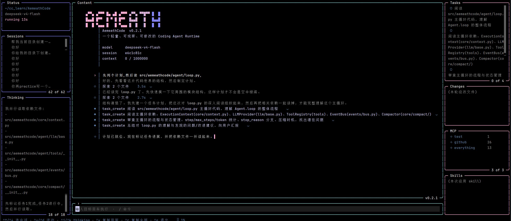
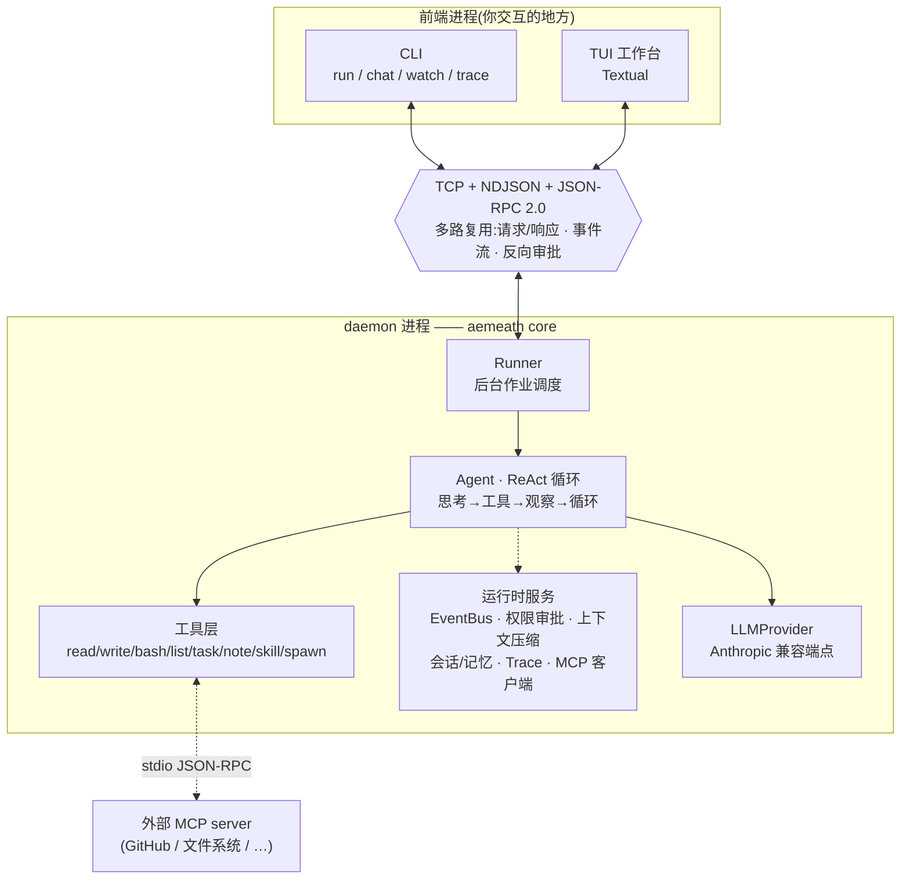

<div align="center">


# AemeathCode

**一个从零手搓的 mini Claude Code —— 既是能跑的终端 AI Agent,也是一趟看得见的系统工程学习历程。**

[](https://www.python.org/)
[](./LICENSE)
[](https://docs.python.org/3/library/asyncio.html)
[](https://textual.textualize.io/)
[](https://modelcontextprotocol.io/)
[](https://github.com/Nijikasuki/AemeathCode/actions/workflows/ci.yml)

</div>

> AemeathCode 把「守护进程 + 多路复用协议 + ReAct Agent」这套 Claude Code 的核心机制,
> 用纯 Python + asyncio 一层一层从零实现了一遍。它不是缝合库,而是 S0→S7 八个阶段
> 逐步推出来的:先有能通信的进程,再有会用工具的循环,再有记忆、权限、压缩、子 agent、MCP。

<div align="center"></div>

---

## ✨ 它能做什么

给它一个目标,它会自己规划步骤、调用工具、观察结果、循环推进,直到把事情做完 —— 全程你在终端里实时看得见:

- 🧠 **自主规划 + 执行(ReAct 循环)** —— 目标 → 思考 → 调工具 → 看结果 → 再思考,直到收敛
- 🛠️ **真的会动手** —— 读写文件、跑 shell 命令、列目录、维护任务清单
- 💾 **有记忆** —— 单轮内多步、会话内多轮、跨会话可 resume,还能自己写下长期笔记
- 🔐 **动手前会问你** —— 危险操作(跑命令 / 写文件)先弹审批,支持「这次 / 永远 / 拒绝」并记住
- 🗜️ **上下文不会爆** —— 历史滚长逼近 token 预算时自动压缩:老对话概括成摘要,最近的逐字保留
- 🤖 **能派分身** —— 主 agent 可以 spawn 子 agent 到隔离上下文里干子任务,还能扮演不同角色
- 🔌 **能接外部工具(MCP)** —— 作为 MCP 客户端连真实的 GitHub / 文件系统等 server,把它们的工具当自己的用

---

## 🚀 快速开始

### 1. 安装

```bash
# 一条命令装成全局命令(推荐,只想用)
pipx install git+https://github.com/Nijikasuki/AemeathCode.git
# 或:uv tool install git+https://github.com/Nijikasuki/AemeathCode.git

# 想删除时(注意用【包名 aemeathcode】,不是命令名 aemeath)
pipx uninstall aemeathcode
```

<details>
<summary>想看源码 / 开发?用 uv 克隆运行</summary>

```bash
git clone https://github.com/Nijikasuki/AemeathCode.git
cd AemeathCode
uv sync
# 之后所有命令前加 uv run,例如:uv run aemeath
```
</details>

### 2. 配置

```bash
cp .env.example .env
# 编辑 .env:填入 ANTHROPIC_BASE_URL / ANTHROPIC_API_KEY / AEMEATH_LLM_DEFAULT_MODEL
```

AemeathCode 对接任何 **Anthropic Messages API 兼容**的端点(官方、DeepSeek、自建网关皆可)。

### 3. 启动

```bash
aemeath          # 就这一条 —— 自动在后台拉起大脑(daemon)并进入 TUI 工作台
```

> 🧠 **一条命令搞定**:AemeathCode 底层是「后台 daemon + 前端」双进程架构,但你不用管——
> `aemeath` 会自动探活、没有就在后台拉起 daemon,再进入界面(像 `docker` 那样)。
> daemon 常驻(下次秒进),用完想关就 `aemeath stop`。

---

## 📟 CLI 命令速查

> `run` / `chat` / `watch` / `tui` 在连接前都会自动确保 daemon 在跑(没有就后台拉起),不用手动开 `core`。

| 命令 | 作用 |
|---|---|
| `aemeath` | 进入 TUI 工作台(等价于 `aemeath tui`;自动拉起后台 daemon) |
| `aemeath run "<目标>"` | 单轮模式:建一个 single-turn 会话跑一发就退 |
| `aemeath chat` | 多轮模式:REPL,复用同一会话连续对话 |
| `aemeath stop` | 关闭后台常驻的 daemon |
| `aemeath watch` | 观察者:旁观所有正在跑的 run 的事件流 |
| `aemeath trace` | 打印最近一次运行的时间线(LLM / 工具耗时汇总) |
| `aemeath ping` | 探活:测 daemon 是否在线(不会自动拉起) |
| `aemeath core` | 手动在前台启动 daemon(想看它的日志时用;平时不用) |
| `aemeath mcp add <name> <命令...>` | 注册一个 MCP server(下次启动 daemon 时连上) |

---

## 🏗️ 架构

AemeathCode 把「前端」和「大脑」拆成两个进程,中间用一条 **TCP + NDJSON + JSON-RPC 2.0** 的多路复用连接
连接。同一根连接上同时跑三种流量:客户端的**请求/响应**、daemon 主动推的**事件流**、以及审批时
daemon **反向问**客户端的 ask/reply。



**核心模块**(源码在 `src/aemeathcode/`):

| 层 | 位置 | 职责 |
|---|---|---|
| 协议 | `bus/`、`transport/` | 信封分帧、多路复用、事件广播、反向审批管道 |
| 编排 | `core/runner.py`、`core/context.py` | 后台 run 调度、per-run 执行上下文 |
| Agent | `agent/loop.py`、`agent/tools/`、`agent/llm/` | ReAct 循环、工具注册表、LLM 防腐层 |
| 能力 | `core/permissions/`、`core/compact/`、`core/session/`、`core/memory/`、`core/trace/` | 权限、压缩、会话/记忆、可观测性 |
| 扩展 | `core/subagent`(工具内)、`core/agents/`、`core/skills/`、`core/mcp/` | 子 agent、角色、技能、MCP 客户端 |
| 前端 | `cli/`、`tui/` | 命令行 / Textual TUI |

---

## 📚 学习历程:S0 → S7

本项目最大的特点是**它是一层一层推出来的**,每个阶段解决一个明确的工程问题。这张表本身
就是一张「怎么从零搭一个 Agent」的路线图:

| 阶段 | 解决的工程问题 | 关键机制 |
|---|---|---|
| **S0** | 两个进程怎么可靠通信 | 守护进程、TCP 粘包与分帧、NDJSON、JSON-RPC 2.0、asyncio 并发、优雅关闭 |
| **S1** | 怎么让它自己用工具干活 | ReAct 循环、工具注册表、领域类型/防腐层、发布订阅事件、依赖注入 |
| **S2** | 一根连接怎么同时跑请求和事件流 | 多路复用、Future 请求/响应配对、后台作业、pub/sub-over-network、状态/逻辑分离 |
| **S3** | 从只读观察者到会写会跑会规划 | 异步子进程、路径安全、任务系统、Trace 可观测性、装饰器/包装器模式 |
| **S4** | 怎么跨轮次 / 跨会话记住东西 | 记忆三层作用域、增量存储 + 索引、指针模型、tool_use/tool_result 配对铁律、进程组信号 |
| **S5** | 危险操作怎么在动手前拦下来 | 反向 RPC(daemon 问客户端)、三态 policy、记住已批、fail-closed、多态替换条件分支 |
| **S6** | 上下文满了怎么办 | token 预算判定、自动压缩(概括老轮次 + 逐字保留尾巴)、辅助 LLM 通道、工作/持久副本分家 |
| **S7** | 怎么扩展能力边界 | 子 agent(隔离上下文)、角色 profiles、按需加载的 skills、**MCP 客户端**(stdio JSON-RPC 握手) |

---

## 🧪 测试

```bash
uv run pytest -q
```

覆盖 framing / registry / policy / invocation / broadcaster / EventBus / skills / profiles /
context / ReAct loop / budget / MCPTool / task / note / session,以及一条 MCP 端到端集成测试。

---

## 🛡️ 安全声明

AemeathCode 是一个能**真实执行 shell 命令、读写本地文件**的 Agent。虽然内置了权限审批
(危险操作前会问你),但请务必:

- 在你信任的、隔离的环境(容器 / 沙箱 / 专用目录)里运行,不要直接指着重要数据跑;
- 审批弹窗出现时看清命令再批,`allow_always` 会记住,别对危险命令随手放行;
- API Key 等密钥放在 `.env`(已被 `.gitignore` 忽略),不要提交。

本项目仅用于学习与研究,使用者对其行为负责。

---

## 🤝 贡献

这是一个学习/展示型项目,欢迎 issue 交流实现思路。如果你也想从零搭一个 Agent,
可以顺着 S0→S7 的顺序读源码。

## 📄 License

[MIT](./LICENSE) © 2026 Nijikasuki

## 🙏 致谢

实现思路参考了 KamaClaude 的分阶段设计.

<div align="center">
<br>

<br><br>
</div>
