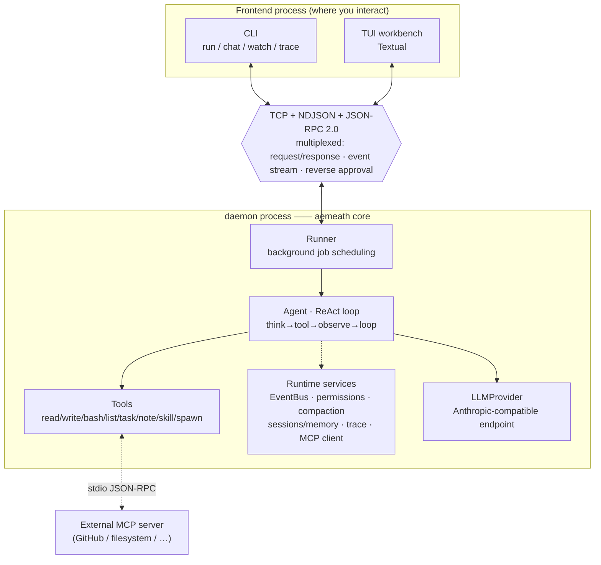

<div align="center">


# AemeathCode

**A coding agent built from scratch —— a working terminal AI agent, and a visible journey through systems engineering.**

[](https://www.python.org/)
[](./LICENSE)
[](https://docs.python.org/3/library/asyncio.html)
[](https://textual.textualize.io/)
[](https://modelcontextprotocol.io/)
[](https://github.com/Nijikasuki/AemeathCode/actions/workflows/ci.yml)

[简体中文](./README.md) · **English**

</div>

> AemeathCode reimplements the core mechanics of a terminal coding agent —— daemon process + multiplexed protocol + ReAct agent —— from the ground up in pure Python + asyncio. It's not a glue-together of libraries; it was pushed out layer by layer across eight stages (S0→S7): first processes that can talk, then a loop that can use tools, then memory, permissions, compaction, sub-agents, and MCP.

<div align="center"></div>

---

## ✨ What it can do

Give it a goal and it plans the steps, calls tools, observes results, and loops until the job is done —— all visible live in your terminal:

- 🧠 **Autonomous plan + execute (ReAct loop)** —— goal → think → call tool → observe → think again, until it converges
- 🛠️ **Actually does things** —— read/write files, run shell commands, list directories, maintain a task list
- 💾 **Has memory** —— multi-step within a run, multi-turn within a session, resumable across sessions, plus long-term notes it writes itself
- 🔐 **Asks before acting** —— dangerous operations (run command / write file) prompt for approval (once / always / deny), and it remembers
- 🗜️ **Context won't overflow** —— when history nears the token budget it auto-compacts: old turns summarized, recent ones kept verbatim
- 🤖 **Can spawn sub-agents** —— the main agent spawns sub-agents in isolated contexts for sub-tasks, and they can play different roles
- 🔌 **Connects external tools (MCP)** —— acts as an MCP client to real GitHub / filesystem servers, using their tools as its own

---

## 🚀 Quick start

### 0. Platform support

| Platform | Status |
|---|---|
| Linux | ✅ Supported |
| macOS | ✅ Supported |
| Windows + WSL2 | ✅ Supported (**use this on Windows**) |
| Windows native (PowerShell / CMD) | ❌ **Not supported** |

Native Windows isn't a porting gap — several core mechanisms are POSIX by design:
the daemon takes SIGINT/SIGTERM through `add_signal_handler` (absent from the Windows
event loop), `aemeath stop` shuts down via process-group signals, and the `bash` tool
is written against a POSIX shell throughout.

On Windows, run it inside WSL2:

```powershell
wsl --install          # admin PowerShell, then reboot
```

Requires **Python 3.12+**.

### 1. Install

```bash
# One command to install as a global command (recommended, just to use it)
pipx install git+https://github.com/Nijikasuki/AemeathCode.git
# or: uv tool install git+https://github.com/Nijikasuki/AemeathCode.git

# To uninstall (note: use the PACKAGE name aemeathcode, not the command name aemeath)
pipx uninstall aemeathcode
```

<details>
<summary>Want the source / to develop? Clone and run with uv</summary>

```bash
git clone https://github.com/Nijikasuki/AemeathCode.git
cd AemeathCode
uv sync
# then prefix commands with uv run, e.g.: uv run aemeath
```
</details>

### 2. Configure

**Nothing to do** — the first `aemeath` run opens a setup wizard asking for three
things (API key, base URL, model name) and writes them to the global config. Run
`aemeath init` any time to change them.

Config is read from two levels, **project overrides global**:

| Priority | Location | Purpose |
|---|---|---|
| 1 (highest) | Real shell environment variables | One-off override, e.g. `AEMEATH_PORT=8888 aemeath` |
| 2 | `.aemeath/.env` in the current directory | Per-project (different model / key) |
| 3 (fallback) | `~/.config/aemeath/.env` | Global: configure once, works anywhere |

> Project config lives in `.aemeath/.env`, **not your project's own `.env`**. That is
> deliberate: your `.env` usually holds `DATABASE_URL` and other secrets, and the agent
> has a `bash` tool whose subprocesses inherit the environment — reading only our own
> file keeps your secrets out of it. `.aemeath/` ships with a self-ignoring `.gitignore`.

**Want a different model / key for just one project?** Any of these three:

```bash
aemeath init --local            # 1. wizard writes .aemeath/.env (without --local it writes global)
cp .env.example .aemeath/.env   # 2. copy the template and edit (every variable is listed there)
                                # 3. or hand-write .aemeath/.env with only the lines you override
```

AemeathCode works with any **Anthropic Messages API–compatible** endpoint (official, DeepSeek, your own gateway, etc.).

### 3. Launch

```bash
aemeath          # just this —— auto-starts the daemon in the background and enters the TUI
```

> 🧠 **One command does it all**: under the hood AemeathCode is a two-process "background daemon + frontend" architecture, but you don't manage it —— `aemeath` probes for the daemon, spawns it in the background if absent, then opens the UI (like `docker`). The daemon stays resident (instant next time); stop it with `aemeath stop`.

---

## 📟 CLI commands

> `run` / `chat` / `watch` / `tui` all ensure the daemon is running before connecting (spawning it if needed) —— no need to start `core` manually.

| Command | What it does |
|---|---|
| `aemeath` | Enter the TUI (same as `aemeath tui`; auto-starts the daemon) |
| `aemeath init` | Re-run the setup wizard, writing global config (restarts a running daemon so it takes effect) |
| `aemeath init --local` | Same, but writes this project's `.aemeath/.env` |
| `aemeath run "<goal>"` | One-shot: create a single-turn session, run once, exit |
| `aemeath chat` | Multi-turn: a REPL reusing one session |
| `aemeath stop` | Shut down the resident background daemon |
| `aemeath watch` | Observer: watch the event stream of all running runs |
| `aemeath trace` | Print the timeline of the latest run (LLM / tool timing summary) |
| `aemeath ping` | Health check: is the daemon up (does not auto-spawn) |
| `aemeath core` | Start the daemon in the foreground manually (to see its logs; usually unneeded) |
| `aemeath mcp add <name> <command...>` | Register an MCP server (connected on next daemon start) |

---

## 🏗️ Architecture

AemeathCode splits "frontend" and "brain" into two processes, connected by a single **TCP + NDJSON + JSON-RPC 2.0** multiplexed link. Three kinds of traffic share that one link: the client's **request/response**, the daemon's pushed **event stream**, and the daemon's **reverse ask/reply** to the client during approvals.



**Core modules** (source in `src/aemeathcode/`):

| Layer | Location | Responsibility |
|---|---|---|
| Protocol | `bus/`, `transport/` | Envelope framing, multiplexing, event broadcast, reverse-approval pipe |
| Orchestration | `core/runner.py`, `core/context.py` | Background run scheduling, per-run execution context |
| Agent | `agent/loop.py`, `agent/tools/`, `agent/llm/` | ReAct loop, tool registry, LLM anti-corruption layer |
| Capabilities | `core/permissions/`, `core/compact/`, `core/session/`, `core/memory/`, `core/trace/` | Permissions, compaction, sessions/memory, observability |
| Extensions | `core/subagent` (in-tool), `core/agents/`, `core/skills/`, `core/mcp/` | Sub-agents, roles, skills, MCP client |
| Frontend | `cli/`, `tui/` | Command line / Textual TUI |

---

## 📚 Learning journey: S0 → S7

The defining feature of this project is that **it was pushed out layer by layer**, each stage solving one concrete engineering problem. The table itself is a roadmap for "how to build an agent from scratch":

| Stage | Engineering problem | Key mechanisms |
|---|---|---|
| **S0** | How can two processes communicate reliably | Daemon, TCP packet framing, NDJSON, JSON-RPC 2.0, asyncio concurrency, graceful shutdown |
| **S1** | How to make it use tools on its own | ReAct loop, tool registry, domain types / anti-corruption layer, pub/sub events, dependency injection |
| **S2** | How one link carries both requests and an event stream | Multiplexing, Future request/response pairing, background jobs, pub/sub-over-network, state/logic separation |
| **S3** | From read-only observer to writing, running, planning | Async subprocess, path safety, task system, trace observability, decorator/wrapper pattern |
| **S4** | How to remember across turns / sessions | Three memory scopes, incremental storage + index, pointer model, tool_use/tool_result pairing rule, process-group signals |
| **S5** | How to intercept dangerous operations before they happen | Reverse RPC (daemon asks client), tri-state policy, remembered approvals, fail-closed, polymorphism over conditionals |
| **S6** | What to do when context fills up | Token budget check, auto-compaction (summarize old turns + keep the tail verbatim), auxiliary LLM channel, working/persistent copy split |
| **S7** | How to extend the capability boundary | Sub-agents (isolated context), agent profiles/roles, on-demand skills, **MCP client** (stdio JSON-RPC handshake) |

---

## 🧪 Tests

```bash
uv run pytest -q
```

Covers framing / registry / policy / invocation / broadcaster / EventBus / skills / profiles / context / ReAct loop / budget / MCPTool / task / note / session, plus one MCP end-to-end integration test.

---

## 🛡️ Security notice

AemeathCode is an agent that can **really execute shell commands and read/write local files**. Although it has built-in permission approval (asking before dangerous operations), please:

- Run it in a trusted, isolated environment (container / sandbox / dedicated directory); don't point it at important data;
- Read commands carefully before approving —— `allow_always` is remembered, so don't wave through dangerous ones;
- Keep secrets in `.aemeath/.env` or `~/.config/aemeath/.env` (the former self-ignores); never commit them.

This project is for learning and research only; users are responsible for its behavior.

---

## 🤝 Contributing

This is a learning / showcase project; issues discussing implementation ideas are welcome. If you'd like to build an agent from scratch too, read the source in S0→S7 order.

## 📄 License

[MIT](./LICENSE) © 2026 Nijikasuki

## 🙏 Acknowledgements

The staged design was inspired by KamaClaude.

<div align="center">
<br>

<br><br>
</div>
